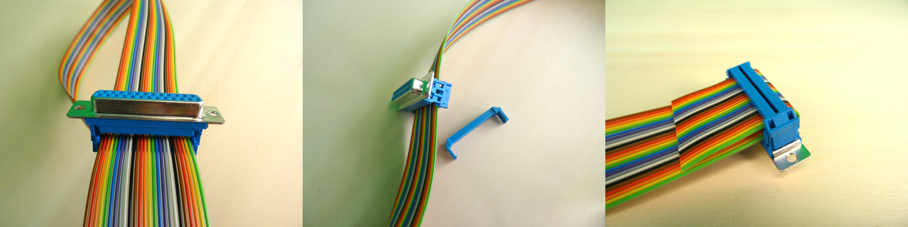
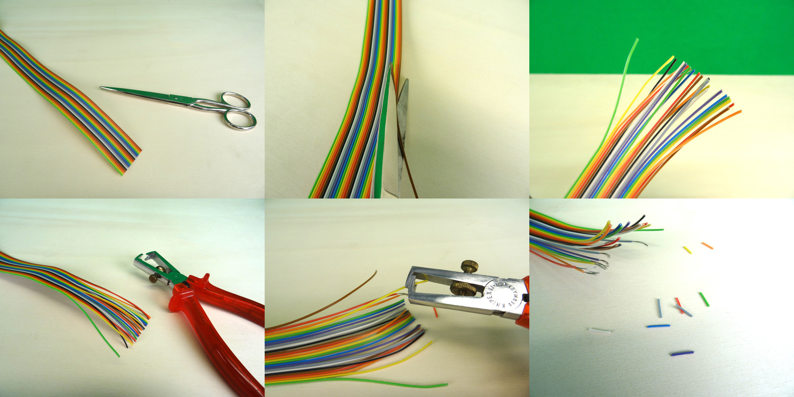
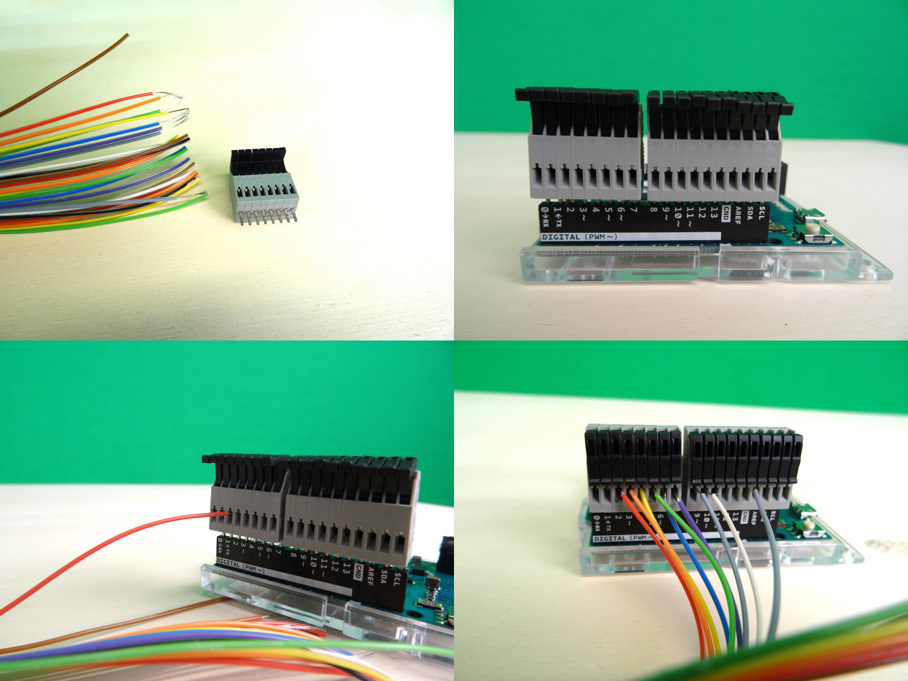
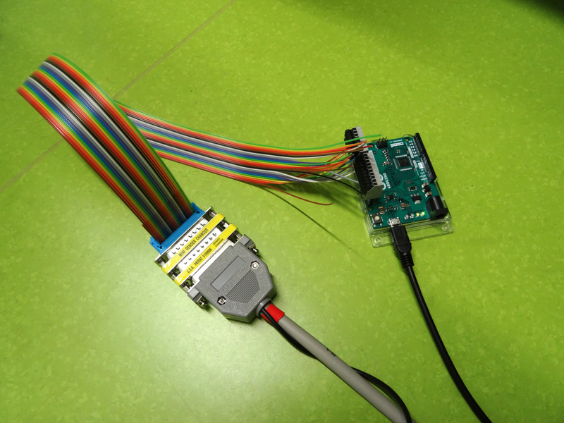

:orphan:

.. _diy-instructions:

Do-it-yourself instructions
===========================

Below we provide a shopping list, build instructions, and the firmware to build your own ``usb-to-ttl`` device.

Shopping list
-------------

The items in this shopping list provide a good start to build a ``usb-to-ttl`` device without soldering and only basic assembly.
For convenience we provide the "price in euros" and the "item number" for all items, according to an online shop (we picked "Reichelt").
To find the items, simply type in the "item number" on the Reichelt shop website.

+-------------------------------+----------------+--------------------------------+
| name                          | price in euros | item-no (https://reichelt.com) |
+===============================+================+================================+
| arduino leonardo              | 18.91          | ARDUINO LEONARDO               |
+-------------------------------+----------------+--------------------------------+
| USB A to micro-B cable        | 1.64           | AK 676-AB2                     |
+-------------------------------+----------------+--------------------------------+
| 10 pin spring-loaded terminal | 1.51           | AST 021-10                     |
+-------------------------------+----------------+--------------------------------+
| 8 pin spring-loaded terminal  | 1.26           | AST 021-08                     |
+-------------------------------+----------------+--------------------------------+
| 25-pin D-SUB female connector | 0.61           | D-SUB BU 25FB                  |
+-------------------------------+----------------+--------------------------------+
| 25 pole flat ribbon cable     | 9.07           | AWG 28-25F 3M                  |
+-------------------------------+----------------+--------------------------------+

.. figure:: ./_static/step0.jpg
   :width: 400px
   :height: 300px
   :align: center
   :alt: photograph of all items

   All items needed to assemble the ``usb-to-ttl`` device.

Build instructions
------------------

Step 1
^^^^^^

   Attaching the db 25 connector to the cables.

Step 2
^^^^^^

   Preparing the wires for putting them into the spring-loaded terminals.

Step 3
^^^^^^

   Connecting the wires with the spring-loaded terminals attached to the Arduino Leonardo.

Step 4
^^^^^^

   The finished device with an attached LPT cable (parallel port).

.. _firmware:

Firmware
--------

This is the firmware that should be uploaded to the microcontroller.
Take care to define the ``outputPins`` according to how you connected your wires.

.. literalinclude:: ../firmware.ino
   :language: C
   :linenos:
